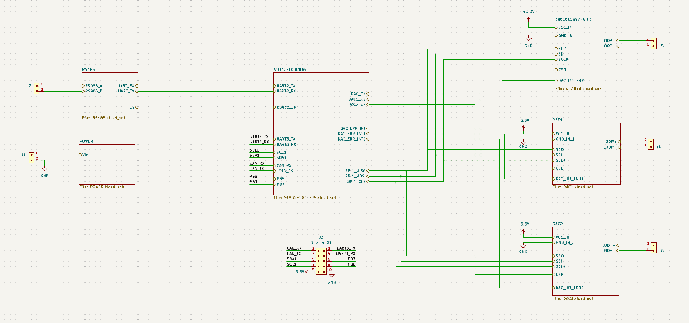
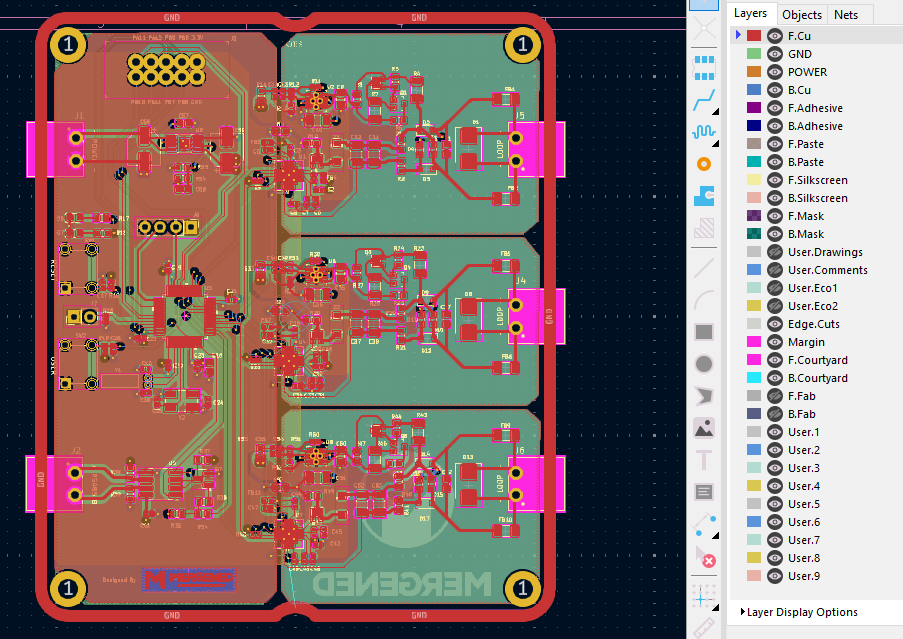
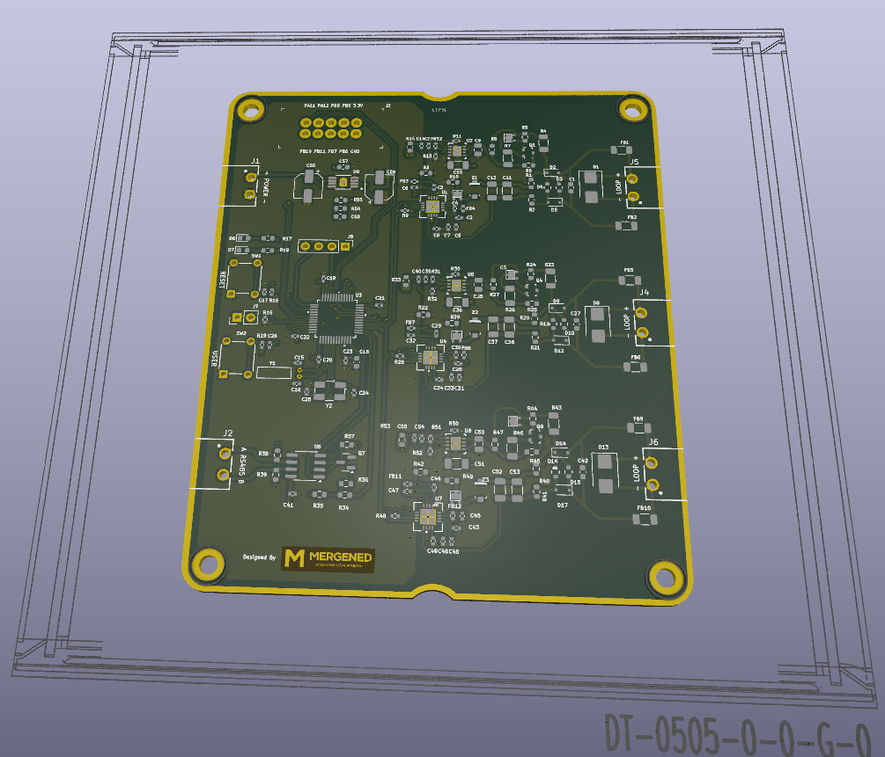
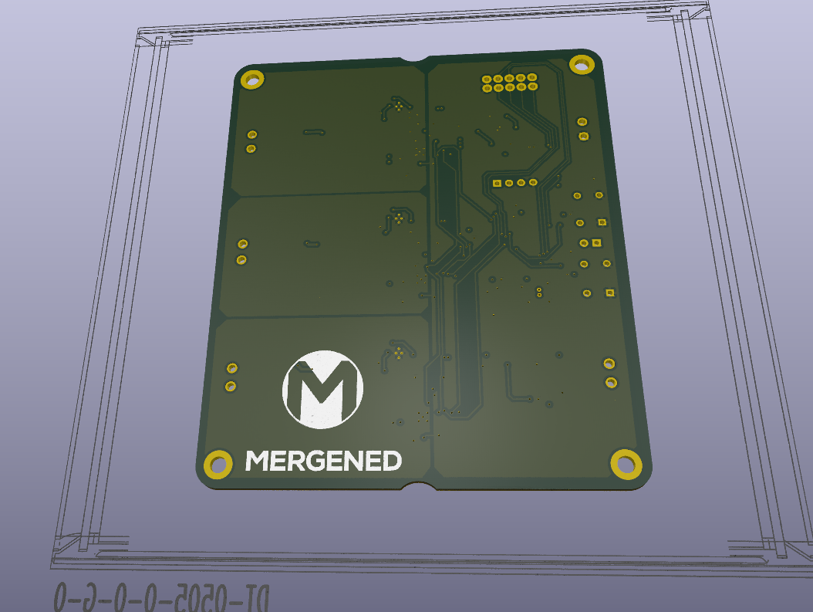
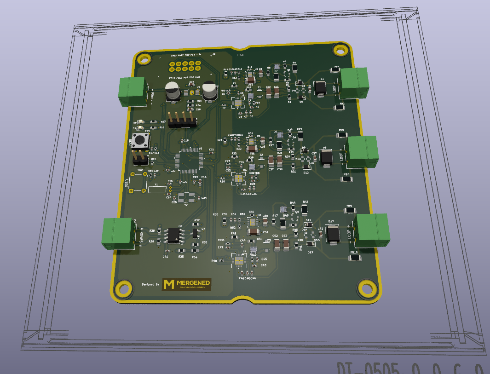

# CURRENT TRANSMITTER KARTI
## KART ÖZELLİKLERİ
- 3 ADET  4-20 mA analog çıkış
- STM32f103C8 mikrodenetleyici 
- RS485 Portu
- 7-28 volt güç girişi
- Aşırı votaj koruması
- Ters bağlantı koruması
- Akım limitleyici

## PCB TASARIM
CURRENT TRANSITTER kartı 4 katlı olacak şekilde KiCad üzerinden tasarlandı. 3 DAC'ın ve Mikrodenetleyicinin GND'leri birbirinden izole şekilde çizildi. PCB, DT-0505 kutusuna uygun olacak şekilde tasarlandı.

